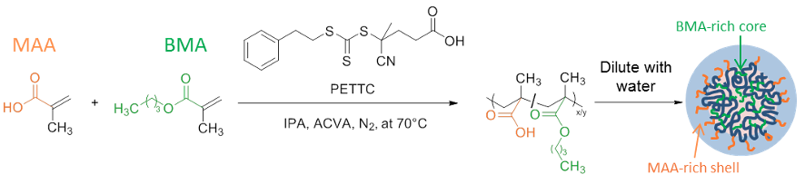

## Self-assembly of statistical copolymers

Research into copolymer self-assembly has focussed mainly on the behaviour of block copolymers where the different monomer types are segregated into discrete blocks.

Statistical copolymers are those where the monomers are statistically distributed within the polymer chain and are relatively understudied. However, statistical copolymers offer distinct advantages over block copolymers, such as being cheap and easy to synthesise.

In collaboration with [Dr Sasha Mykhaylyk's group](https://www.sheffield.ac.uk/chemistry/people/academic/oleksandr-o-mykhaylyk) and [AkzoNobel](https://www.akzonobel.com/) we have investigated the self-assembly of statistical copolymers to develop some "design rules".

  

Our initial work focussed on the copolymers of methacrylic acid and butyl methacrylate and found that their self-assembly was independent of the polymer chain length/molar mass but was highly dependent on their composition and we developed a surface charge-based model to rationalise the data.

  

More recently, we examined the self-assembly behaviour of charged amphiphilic statistical copolymers and the effects of both copolymer composition and hydrophobicity on their assembly. Using small-angle X-ray scattering (SAXS), it was found that these copolymers aggregated into spherical particles in the presence of aqueous media and that decreasing either the charged hydrophilic component or increasing the hydrophobicity (logP) of the hydrophobic component led to increased particle size. We developed a model to describe the observed behaviour based upon the hypothesis that the copolymers aggregate to achieve a critical surface charge density  and colloidal stability (the PSC model). The PSC model fitted extremely well with the experimental data and we found a linear correlation between the charge density and the logP of the hydrophobic component. This research demonstrates the predictable behaviour of statistical copolymer dispersions, and the developed PSC model can be used as a tool to design bespoke nanoparticles that can offer a cheaper, more industrially viable, alternative to block copolymers in a variety of applications.

<h3>Relevant Papers</h3>



    {{ paper.authors }}; "{{ paper.title }}", <em>{{ paper.journal }}</em>, {{ paper.year }},  <strong>{{ paper.volume }}</strong>, {{ paper.pages }}. <a href="http://dx.doi.org/{{ paper.doi }}">[DOI]</a>
    <a href="summaries/{{ paper.year }}/{{ paper.id }}.html">[Summary]</a>
    <a href="/non_foss/publications/PDFs/{{ paper.year }}/{{ paper.doi_short }}.pdf">[PDF]</a>
     




## Electrospun patches for mucosal drug delivery

<h3>Relevant Papers</h3>



    {{ paper.authors }}; "{{ paper.title }}", <em>{{ paper.journal }}</em>, {{ paper.year }},  <strong>{{ paper.volume }}</strong>, {{ paper.pages }}. <a href="http://dx.doi.org/{{ paper.doi }}">[DOI]</a>
    <a href="summaries/{{ paper.year }}/{{ paper.id }}.html">[Summary]</a>
    <a href="/non_foss/publications/PDFs/{{ paper.year }}/{{ paper.doi_short }}.pdf">[PDF]</a>
     




## Smart and Programmable Materials in Drug Delivery

Smart materials are those that respond to...

Some examples (temp-controlled uptake and DNA materials)

Current research in oxidation-responsive materials

## Reversible composites and adhesives

## Sustainability in Polymer Science
